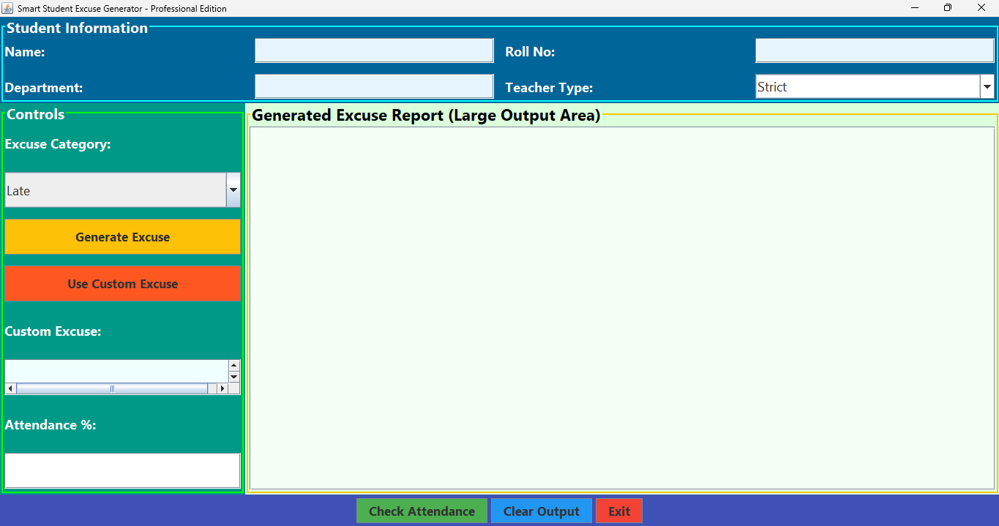
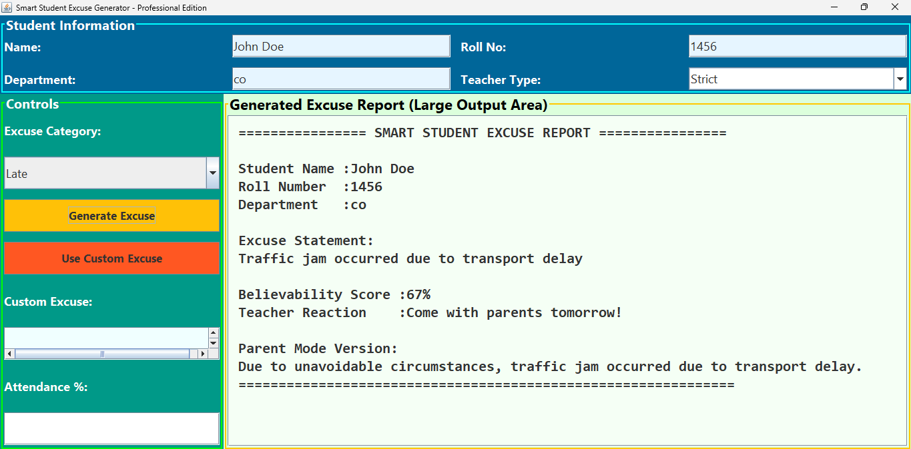
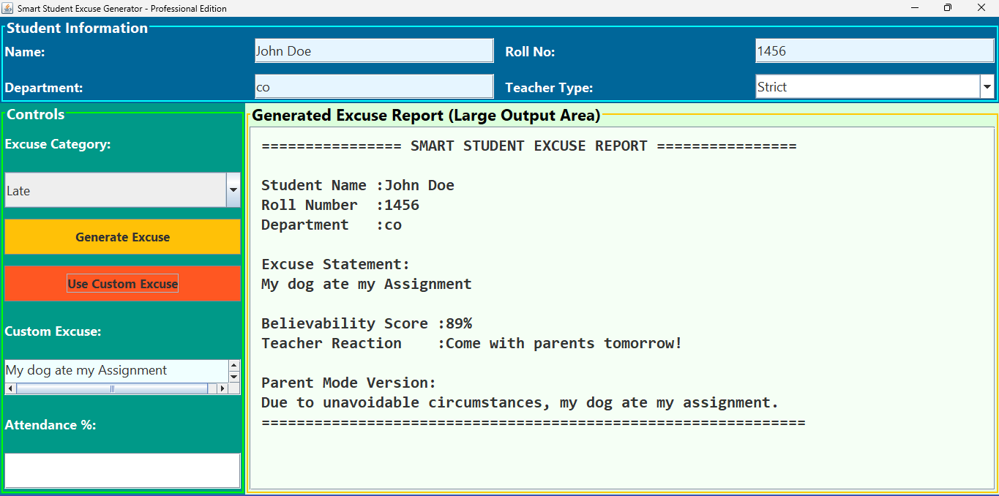
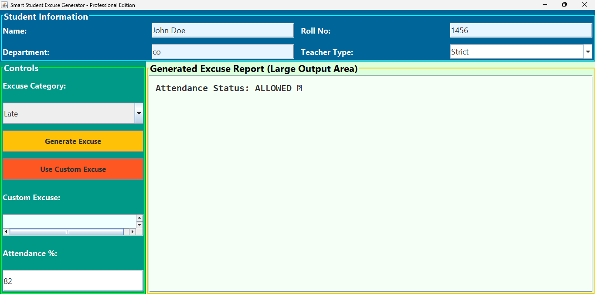

# Smart Student Excuse Generator Pro

A Java AWT + Swing application that generates creative excuses for students.

## Features

- Student Information Management
- Excuse Generator
- Attendance Checker
- Teacher Reaction Simulator
- Parent Mode Converter
- Professional GUI

## Technologies

- Java
- AWT
- Swing

## Run

```bash
javac SmartStudentExcuseGeneratorPro.java
java SmartStudentExcuseGeneratorPro
``` 
## Screenshots

### Main Window


### Excuse Generator


### Attendance Checker


### Generated Report
